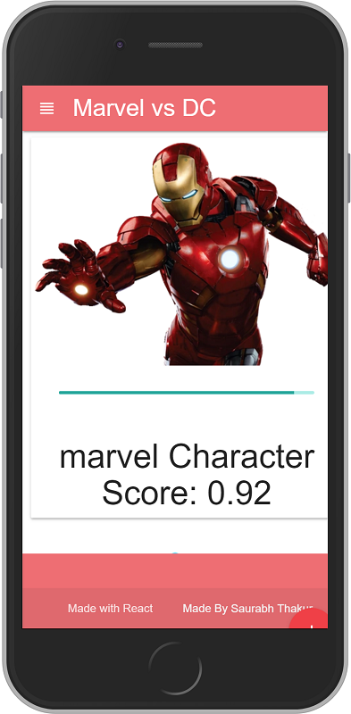

# Express REST API For IBM Watson Marvel vs DC

### This application was created for the Topcoder Cognitive Community Challenge

> You can check out the app [here](https://marveldc.herokuapp.com)

> Also the front end react app repository is [here](https://github.com/thakursaurabh1998/watson-heros-reactapp)

> This is a backend API server which is created with express.

The main function of this server is to receive the images link from the front end react app and pass it on to the IBM Visual Recognition API which then further processes it and returns whether the character belongs to Marvel or DC.

I have used basic set of 3 heroes for each franchise:

_Marvel_
1. Iron Man
1. Hulk
1. Captain America

_DC_
1. Bat Man
1. Super Man
1. Aqua Man

#### Some sample links to test the APP

> Just copy and paste these links in the app

1. Aquaman : https://i1.wp.com/batman-news.com/wp-content/uploads/2015/06/aquaman.jpg?resize=696%2C1043&quality=80&strip=info&ssl=1
1. Batman : https://upload.wikimedia.org/wikipedia/en/thumb/1/17/Batman-BenAffleck.jpg/200px-Batman-BenAffleck.jpg
1. Hulk : https://upload.wikimedia.org/wikipedia/en/5/59/Hulk_%28comics_character%29.png
1. Iron Man : https://www.sideshowtoy.com/assets/products/903341-iron-man-mark-iv/lg/marvel-iron-man-2-iron-man-mark-4-sixth-scale-figure-hot-toys-903340-08.jpg